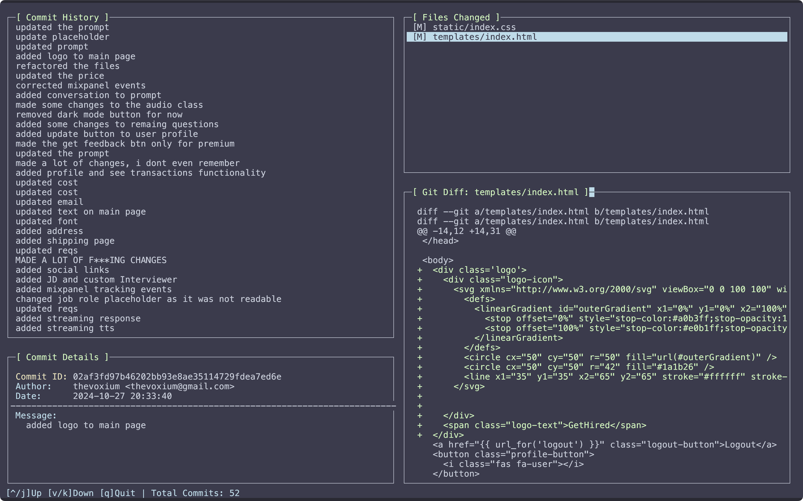

# Git TUI - Terminal User Interface for Git Repository Exploration

A terminal-based user interface for exploring Git repositories, allowing you to browse commit history, view file changes, and inspect diffs in an interactive manner.

## Screenshot




## Features

- **Interactive Commit History**: Browse through all commits in your repository with commit messages and timestamps
- **Detailed Commit Information**: View complete commit details including author, date, and full commit message
- **File Change Tracking**: See all files modified in each commit with their status (Added, Modified, Deleted)
- **Interactive Diff Viewer**: Examine the exact changes made to each file with syntax highlighting
- **Keyboard Navigation**: Easy navigation between different views using keyboard shortcuts
- **Scrollable Windows**: All views support scrolling for handling large amounts of content

## Requirements

- C++ compiler (g++)
- libgit2 (For Git operations)
- ncurses (For terminal UI)
- Git repository to browse

### macOS Dependencies
```bash
brew install libgit2
brew install ncurses
```

### Linux Dependencies
```bash
# Ubuntu/Debian
sudo apt-get install libgit2-dev libncurses5-dev

# Fedora
sudo dnf install libgit2-devel ncurses-devel

# Arch Linux
sudo pacman -S libgit2 ncurses
```

## Installation

1. Clone the repository:
```bash
git clone [your-repository-url]
cd [repository-name]
```

2. Run the build script:
```bash
chmod +x build.sh
./build.sh
```

This will:
- Compile the program
- Create a `~/bin` directory if it doesn't exist
- Copy the executable to `~/bin`
- Make it accessible from anywhere in your system

3. Add the following to your shell configuration file (`~/.zshrc` or `~/.bashrc`):
```bash
export PATH="$HOME/bin:$PATH"
alias gt='git-tui $(git rev-parse --show-toplevel)'
```

4. Reload your shell configuration:
```bash
source ~/.zshrc  # or source ~/.bashrc
```

## Usage

### Starting the Browser

There are several ways to start the Git TUI browser:

1. From any directory:
```bash
git-tui /path/to/repository
```

2. From within a Git repository (if you set up the alias):
```bash
gt
```

### Navigation

The interface is divided into four main panels:
- **Commit History** (Top Left): Lists all commits
- **Commit Details** (Bottom Left): Shows detailed information about the selected commit
- **Files Changed** (Top Right): Lists all files modified in the selected commit
- **Diff View** (Bottom Right): Shows the diff for the selected file

#### Keyboard Controls

- **Tab**: Cycle between panels (Commit History → Files Changed → Diff View)
- **Up Arrow** or **j**: Move cursor up
- **Down Arrow** or **k**: Move cursor down
- **q**: Quit the application

### Workflow

1. Navigate through commits in the Commit History panel
2. Select a commit to view its details and changed files
3. Navigate to the Files Changed panel to select a specific file
4. View the file's diff in the Diff View panel
5. Scroll through the diff to examine changes

## Building from Source

If you want to build the program manually instead of using the build script:

```bash
g++ -o git-tui main.cpp \
    -I/opt/homebrew/opt/libgit2/include \
    -L/opt/homebrew/opt/libgit2/lib \
    -lncurses -lgit2
```


## Support

If you encounter any issues or have questions, please file an issue on the GitHub repository.
